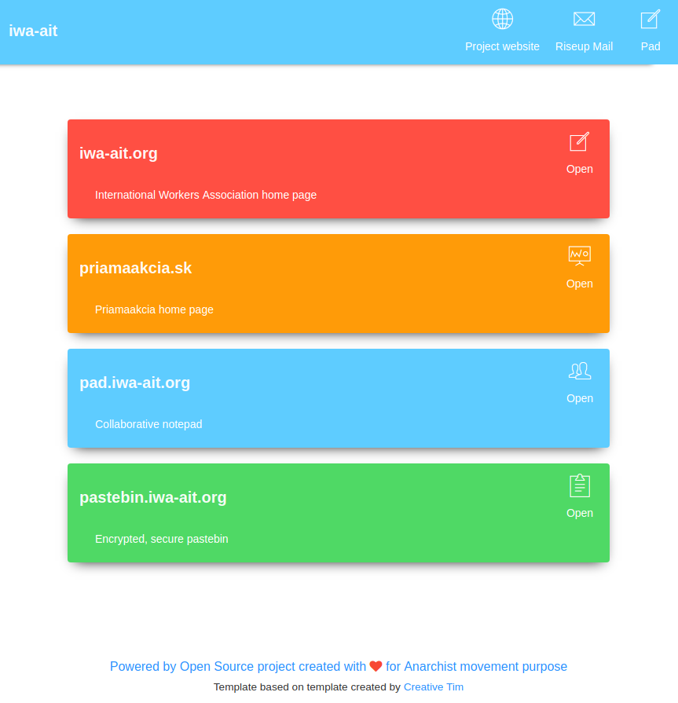

Docker Services Dashboard
=========================

Landing page for your initiative.
Run containers with different web applications eg. etherpad + wekan + your custom app, and show the list of applications dynamically on a nice looking landing page.



### Requirements

If you run `wolnosciowiec/services-dashboard` docker container you should not have a need to install any dependencies.

- Python 3
- Flask

### Running without any configuration

```bash
make start
make open_prod_in_web_browser
```

### Running with docker-compose

```yaml
version: '2'
services:
      dashboard:
          image: wolnosciowiec/services-dashboard
          volumes:
              - "/var/run/docker.sock:/var/run/docker.sock:ro"
          environment:
              - "APP_NAME=Anarchist Federation collaborative tools"
              - "APP_PROVIDER=docker"                          # default
              - "APP_PROVIDER_URL=unix:///var/run/docker.sock" # default
                
              # allows to mark some of services as "only for admin" and show them
              # on endpoint http://yourdomain/admin/pss-its-secret
              - "APP_ADMIN_TOKEN=pss-its-secret"   
```

# How does it work?

The application accesses docker/kubernetes/swarm and collects information about the containers.
In labels or environment variables there should be provided information about the containers.

Example service configuration:
```yaml
    app_etherpad:
        image: phocean/etherpad
        volumes:
            - "./data/etherpad:/opt/etherpad-lite/var"
        expose:
            - "9001"
        environment:
            - NODE_ENV=production

            # gateway
            - VIRTUAL_HOST=notepad.${MAIN_DOMAIN}${DOMAIN_SUFFIX}
            - VIRTUAL_PORT=9001
            - LETSENCRYPT_HOST=notepad.${MAIN_DOMAIN}${DOMAIN_SUFFIX}
            - LETSENCRYPT_EMAIL=example@example.org
        labels:
            org.riotkit.dashboard.enabled: true
            org.riotkit.dashboard.description: 'Collaborative notepad'
            org.riotkit.dashboard.icon: 'pe-7s-note'
            org.riotkit.dashboard.only_for_admin: false
            org.riotkit.dashboard.domain: "notepad.${MAIN_DOMAIN}${DOMAIN_SUFFIX}"
```

Configuration reference:
```yaml
APP_PROVIDER=docker
APP_PROVIDER_URL=/var/run/docker.sock
APP_NAME=Docker Services Dashboard
APP_ADMIN_TOKEN=YOUR-SECRET-ADMIN-KEY
```

### Customizing

Beside environment variables you can pass such as admin token and application name, you can also replace some of the
texts and links in the application.

The icons on the right of the header are customizable as well as there is a possibility to define a welcome text.

```yaml
    dashboard:
        (...)
        volumes:
            - ./data/texts/header.html:/app/project/client/templates/texts/header.html:ro
            - ./data/texts/intro-text.html:/app/project/client/templates/texts/intro-text.html:ro
```

In the HTML templates you can use JINJA2 syntax, but please note that the application will not get up
if you will have an error or a typo in the JINJA2 syntax.

Examples:
```html
<a class="navbar-brand" href="#">{{ config.APP_NAME }}</a>
```
